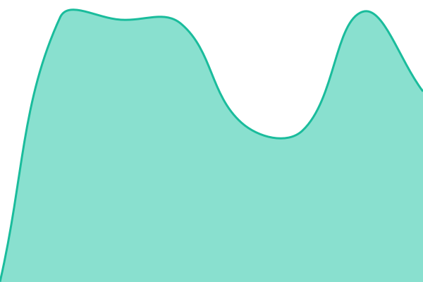
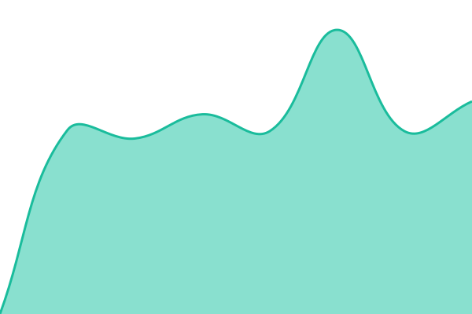
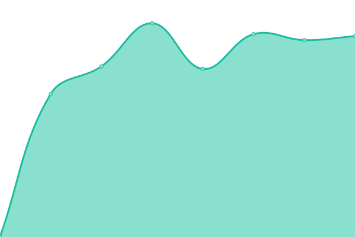
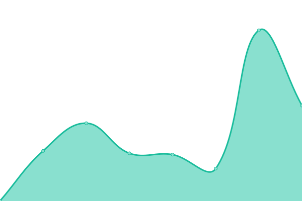
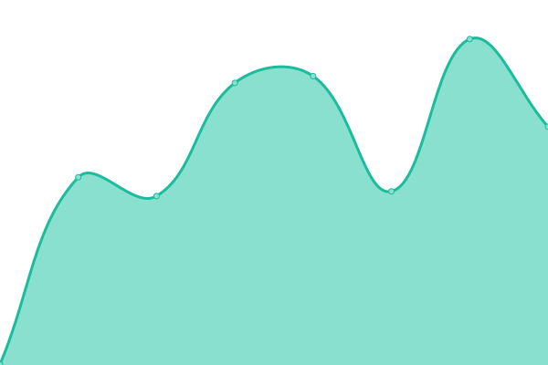

# [📈 Live Status](https://porrale.github.io/status): <!--live status--> **🟧 Partial outage**

This repository contains the open-source uptime monitor and status page for [Edgardo](https://porrale.github.io/status), powered by [Upptime](https://github.com/upptime/upptime).

With [Upptime](https://upptime.js.org), you can get your own unlimited and free uptime monitor and status page, powered entirely by a GitHub repository. We use [Issues](https://github.com/porrale/status/issues) as incident reports, [Actions](https://github.com/porrale/status/actions) as uptime monitors, and [Pages](https://porrale.github.io/status) for the status page.

<!--start: status pages-->
<!-- This summary is generated by Upptime (https://github.com/upptime/upptime) -->
<!-- Do not edit this manually, your changes will be overwritten -->
<!-- prettier-ignore -->
| URL | Status | History | Response Time | Uptime |
| --- | ------ | ------- | ------------- | ------ |
|  [Google](https://www.google.com) | 🟩 Up | [google.yml](https://github.com/porrale/status/commits/HEAD/history/google.yml) | 

 91ms
     
 | 

<a href="https://porrale.github.io/status/history/google">100.00%</a>
    

|  [Notariar](https://notariar.com.ar) | 🟥 Down | [notariar.yml](https://github.com/porrale/status/commits/HEAD/history/notariar.yml) | 

 0ms
     
 | 

<a href="https://porrale.github.io/status/history/notariar">0.00%</a>
    

|  [TFM IT Solutions](https://tfmit.com) | 🟩 Up | [tfm-it-solutions.yml](https://github.com/porrale/status/commits/HEAD/history/tfm-it-solutions.yml) | 

 1115ms
     
 | 

<a href="https://porrale.github.io/status/history/tfm-it-solutions">97.94%</a>
    

|  [PrivilegedBA](https://privilegedba.com.ar) | 🟩 Up | [privileged-ba.yml](https://github.com/porrale/status/commits/HEAD/history/privileged-ba.yml) | 

 4210ms
     
 | 

<a href="https://porrale.github.io/status/history/privileged-ba">100.00%</a>
    

|  [Villegas Pasteleria](https://andreavillegasapp.com) | 🟩 Up | [villegas-pasteleria.yml](https://github.com/porrale/status/commits/HEAD/history/villegas-pasteleria.yml) | 

 2187ms
     
 | 

<a href="https://porrale.github.io/status/history/villegas-pasteleria">100.00%</a>
    

|  [Madero Parking](https://maderoparking.com) | 🟩 Up | [madero-parking.yml](https://github.com/porrale/status/commits/HEAD/history/madero-parking.yml) | 

 1266ms
     
 | 

<a href="https://porrale.github.io/status/history/madero-parking">100.00%</a>
    

|  [ORD Agencias](https://ordagencias.com.ar) | 🟥 Down | [ord-agencias.yml](https://github.com/porrale/status/commits/HEAD/history/ord-agencias.yml) | 

 0ms
     
 | 

<a href="https://porrale.github.io/status/history/ord-agencias">0.00%</a>
    

|  [Agencias TFM - Gestion de loterias](https://agenciastfm.com.ar) | 🟥 Down | [agencias-tfm-gestion-de-loterias.yml](https://github.com/porrale/status/commits/HEAD/history/agencias-tfm-gestion-de-loterias.yml) | 

 0ms
     
 | 

<a href="https://porrale.github.io/status/history/agencias-tfm-gestion-de-loterias">0.00%</a>
    

|  [Condor](https://ascensorescondor.com) | 🟥 Down | [condor.yml](https://github.com/porrale/status/commits/HEAD/history/condor.yml) | 

 0ms
     
 | 

<a href="https://porrale.github.io/status/history/condor">0.00%</a>
    

<!--end: status pages-->

[**Visit our status website →**](https://porrale.github.io/status)

## 📄 License

- Powered by: [Upptime](https://github.com/upptime/upptime)
- Code: [MIT](./LICENSE) © [Edgardo](https://porrale.github.io/status)
- Data in the `./history` directory: [Open Database License](https://opendatacommons.org/licenses/odbl/1-0/)
